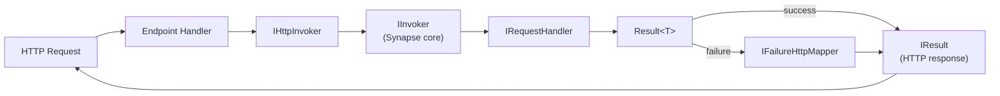

# ASP.NET Core Integration

`UnambitiousFx.Synapse.AspNetCore` provides two invoker wrappers that translate `Result<T>` to HTTP responses automatically, so endpoint handlers stay free of mapping boilerplate.

## Install

```bash
dotnet add package UnambitiousFx.Synapse.AspNetCore
```

## Setup

```csharp
builder.Services.AddSynapse(cfg => { /* ... */ });
builder.Services.AddSynapseAspNetCore();

var app = builder.Build();
app.UseCorrelationId(); // optional — reads/writes X-Correlation-Id header
```

## HTTP request flow



## `IHttpInvoker` — Minimal API

`IHttpInvoker` wraps `IInvoker` and converts `Result<T>` to `IResult` using `IFailureHttpMapper` for failures:

### Default success mapping — `200 OK`

```csharp
app.MapGet("/tasks/{id}", async (
    Guid id,
    [FromServices] IHttpInvoker invoker,
    CancellationToken ct) =>
    await invoker.InvokeAsync(new GetTaskQuery(id), ct));
// Success → 200 OK with the value serialized as JSON
// Failure → mapped by IFailureHttpMapper (default: ProblemDetails)
```

### Custom success mapping

Pass a delegate to control the success response:

```csharp
app.MapPost("/tasks", async (
    [FromBody] CreateTaskCommand cmd,
    [FromServices] IHttpInvoker invoker,
    CancellationToken ct) =>
    await invoker.InvokeAsync(
        cmd,
        id => Results.Created($"/tasks/{id}", id),  // ← custom success mapper
        ct));
```

### Fire-and-forget commands

```csharp
app.MapDelete("/tasks/{id}", async (
    Guid id,
    [FromServices] IHttpInvoker invoker,
    CancellationToken ct) =>
    await invoker.InvokeAsync(new DeleteTaskCommand(id), ct));
// Success → 200 OK (no body)
// Failure → ProblemDetails
```

### Streaming

```csharp
app.MapGet("/tasks/stream", (
    [FromServices] IHttpInvoker invoker,
    CancellationToken ct) =>
    invoker.InvokeStreamAsync(new StreamTasksQuery(), ct));
// Returns IAsyncEnumerable<TaskDto> — ASP.NET Core streams the JSON array
```

`IHttpInvoker.InvokeStreamAsync` unwraps `Result<TItem>` automatically: successful items are yielded, failures are silently skipped.

## `IMvcInvoker` — Controller-based API

Same contract as `IHttpInvoker` but returns `IActionResult` for use in MVC controllers:

```csharp
[ApiController]
[Route("tasks")]
public class TasksController : ControllerBase
{
    private readonly IMvcInvoker _invoker;

    public TasksController(IMvcInvoker invoker) => _invoker = invoker;

    [HttpGet("{id}")]
    public Task<IActionResult> Get(Guid id, CancellationToken ct) =>
        _invoker.InvokeAsync(new GetTaskQuery(id), ct);

    [HttpPost]
    public Task<IActionResult> Create([FromBody] CreateTaskCommand cmd, CancellationToken ct) =>
        _invoker.InvokeAsync(cmd, id => Created($"/tasks/{id}", id), ct);
}
```

## Failure mapping — `IFailureHttpMapper`

By default, failures are mapped to [RFC 9457 ProblemDetails](https://www.rfc-editor.org/rfc/rfc9457) responses. Replace the mapper with a custom implementation by registering it as a singleton **before** `AddSynapseAspNetCore`:

```csharp
builder.Services.AddSingleton<IFailureHttpMapper, MyFailureHttpMapper>();
builder.Services.AddSynapseAspNetCore();
```

```csharp
public class MyFailureHttpMapper : IFailureHttpMapper
{
    public IResult Map(IFailure failure)
    {
        return failure switch
        {
            NotFoundFailure nf => Results.NotFound(new { nf.Message }),
            ValidationFailure vf => Results.UnprocessableEntity(new { vf.Message }),
            _ => Results.Problem(failure.ToString())
        };
    }
}
```

## Correlation ID middleware

`UseCorrelationId()` reads the incoming `X-Correlation-Id` header and sets it on `IContext.CorrelationId`. It also writes the correlation ID back to the response header so callers can correlate requests across service boundaries:

```csharp
app.UseCorrelationId();
```

If no `X-Correlation-Id` header is present, the context uses the ID already generated by `IContextFactory`.

## NativeAOT / Trim compatibility

When publishing with `PublishSingleFile=true` or `PublishAot=true`, use `WebApplication.CreateSlimBuilder` and configure the JSON serializer context so all request/response types are included:

```csharp
var builder = WebApplication.CreateSlimBuilder(args);

builder.Services.ConfigureHttpJsonOptions(opts =>
    opts.SerializerOptions.TypeInfoResolverChain.Insert(0, AppJsonContext.Default));

[JsonSerializable(typeof(CreateTaskCommand))]
[JsonSerializable(typeof(Guid))]
[JsonSerializable(typeof(TaskDto))]
internal partial class AppJsonContext : JsonSerializerContext { }
```

Also use the [Source Generator](./source-generator) to generate `EventDispatcherRegistration`, which is required for NativeAOT-safe polymorphic event dispatch.

## See also

- [Getting Started](./getting-started) — full end-to-end example with Minimal API.
- [Streaming](./streaming) — `IHttpInvoker.InvokeStreamAsync` details.
- [Source Generator](./source-generator) — NativeAOT-safe handler registration.
- [Context](./context) — `IContext.CorrelationId` and the `UseCorrelationId` header propagation.
