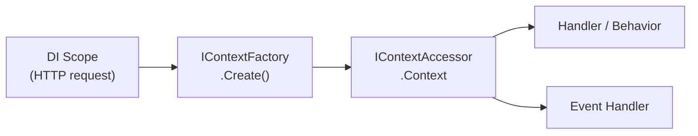

# Context

`IContext` is a per-DI-scope object that flows through every step of a request's lifecycle — the handler, all pipeline behaviors, and any events published during that request. It provides a correlation ID, a metadata bag, and an extensible feature system.

## Lifecycle

One `IContext` instance is created per DI scope. In an ASP.NET Core application, one HTTP request equals one DI scope, so each request gets its own context:



The context is created lazily on first access via `IContextFactory`, then cached on `IContextAccessor` for the lifetime of the scope.

## Correlation ID

Every context carries a `CorrelationId` (`Guid`). The default factory generates this with `Guid.CreateVersion7()` (.NET 9+) or `Guid.NewGuid()` on earlier runtimes.

```csharp
public class MyHandler : IRequestHandler<MyCommand, Guid>
{
    private readonly IContext _context;

    public MyHandler(IContext context) => _context = context;

    public ValueTask<Result<Guid>> HandleAsync(MyCommand cmd, CancellationToken ct = default)
    {
        var correlationId = _context.CorrelationId;
        // use correlationId for logging, tracing, audit ...
        return ValueTask.FromResult(Result.Success(correlationId));
    }
}
```

With the ASP.NET Core integration, `UseCorrelationId()` reads the `X-Correlation-Id` request header and sets it on the context, then echoes it back in the response. See [ASP.NET Core Integration](./aspnetcore#correlation-id-middleware).

## Metadata

The metadata bag is a `string → object` dictionary attached to the context. Use it to propagate ambient values through the request lifecycle without adding them to every method signature.

```csharp
// Write
context.SetMetadata("TenantId", "acme");

// Read with type safety
if (context.TryGetMetadata<string>("TenantId", out var tenantId))
    Console.WriteLine(tenantId);

// Read directly (returns null if missing)
var tenantId = context.GetMetadata<string>("TenantId");
```

`DefaultContextFactory` automatically stores `OccuredAt` (`DateTimeOffset.UtcNow`) in metadata at context creation time.

## Context factories

Two built-in factories are available. Configure them in `AddSynapse`:

| Factory                 | What it creates                                                                                          |
| ----------------------- | -------------------------------------------------------------------------------------------------------- |
| `DefaultContextFactory` | New Guid v7 correlation ID + `OccuredAt` metadata + captures current `Activity` for distributed tracing. |
| `SlimContextFactory`    | Bare context — just a new `Guid`. No metadata, no tracing.                                               |

```csharp
services.AddSynapse(cfg =>
{
    cfg.UseDefaultContextFactory(); // default — no need to call if this is what you want
    // or
    cfg.UseSlimContextFactory();
    // or
    cfg.UseContextFactory<MyCustomFactory>();
});
```

## Feature bag

`IContextFeature` provides a typed extension point for attaching domain-specific data to the context without modifying `IContext` itself.

### Define a feature

```csharp
public class UserFeature : IContextFeature
{
    public string Name => "User";
    public string UserId { get; init; } = "";
    public string[] Roles { get; init; } = [];
}
```

### Set the feature

Set it in a pipeline behavior or middleware before the handler runs:

```csharp
public class AuthenticationBehavior : IRequestPipelineBehavior
{
    private readonly IContextAccessor _contextAccessor;
    private readonly ICurrentUser _currentUser;

    public AuthenticationBehavior(IContextAccessor contextAccessor, ICurrentUser currentUser)
    {
        _contextAccessor = contextAccessor;
        _currentUser = currentUser;
    }

    public async ValueTask<Result<TResponse>> HandleAsync<TRequest, TResponse>(
        TRequest request,
        RequestHandlerDelegate<TResponse> next,
        CancellationToken ct)
        where TRequest : IRequest<TResponse>
        where TResponse : notnull
    {
        _contextAccessor.Context.SetMetadata("User", new UserFeature
        {
            UserId = _currentUser.Id,
            Roles  = _currentUser.Roles
        });

        return await next();
    }

    public ValueTask<Result> HandleAsync<TRequest>(
        TRequest request,
        RequestHandlerDelegate next,
        CancellationToken ct)
        where TRequest : IRequest
        => next();
}
```

### Read the feature

```csharp
// Try to get feature (returns false if not set)
if (context.TryGetFeature<UserFeature>(out var user))
    Console.WriteLine(user.UserId);

// Get or null
var user = context.GetFeature<UserFeature>();

// Get or throw MissingContextFeatureException
var user = context.GetRequiredFeature<UserFeature>();
```

## Publishing events from handlers

`IContext` exposes `PublishEventAsync` as syntactic sugar over `IEmitter.EmitAsync`. This lets handlers publish events without injecting `IEmitter` separately:

```csharp
await context.PublishEventAsync(new TaskCreatedEvent(id, cmd.Title), ct);

// With explicit emit mode
await context.PublishEventAsync(new TaskCreatedEvent(id, cmd.Title), EmitMode.Outbox, ct);
```

## Injecting the context

`IContext` and `IContextAccessor` are registered in DI. Inject either one depending on whether you need to set or just read the context:

```csharp
// Read-only — inject IContext directly
public class MyHandler(IContext context) : IRequestHandler<MyQuery, string>  { ... }

// Write — inject IContextAccessor to also be able to set the context
public class MyMiddleware(IContextAccessor contextAccessor) { ... }
```

## See also

- [ASP.NET Core Integration](./aspnetcore) — `UseCorrelationId()` middleware.
- [Pipeline Behaviors](./pipelines) — set context features in behaviors before the handler runs.
- [Events](./events) — `IContext.PublishEventAsync` and `EmitMode`.
