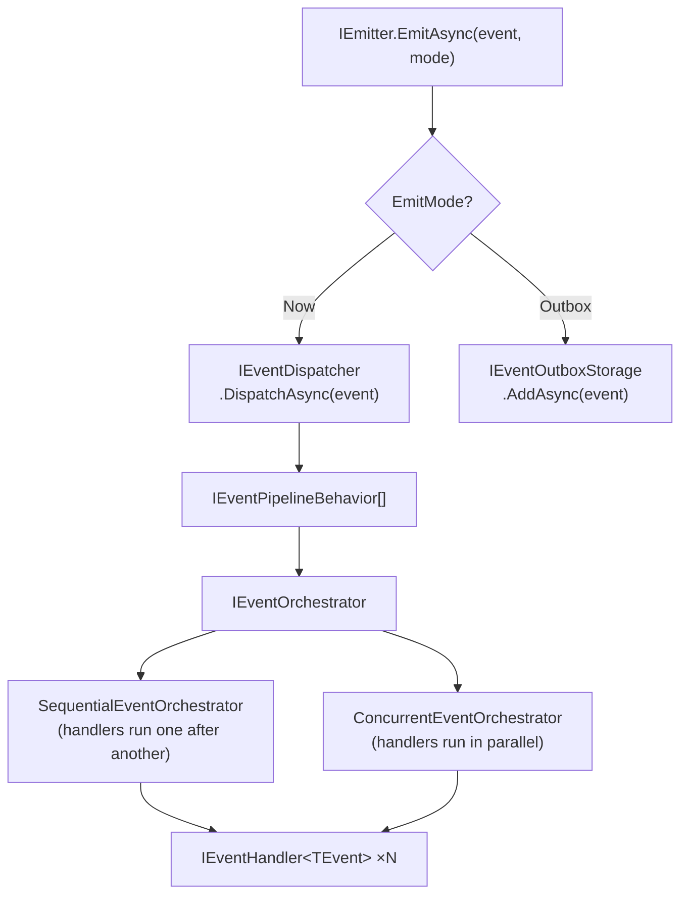

# Events

Events let a handler notify the rest of the system that something happened, without knowing which components care. Multiple handlers can subscribe to the same event and all of them run.

## Define an event

An event is a plain class or record that implements `IEvent`:

```csharp
using UnambitiousFx.Synapse.Abstractions;

public record TaskCreatedEvent(Guid TaskId, string Title) : IEvent;
```

## Implement an event handler

```csharp
public class SendWelcomeEmailOnTaskCreated : IEventHandler<TaskCreatedEvent>
{
    private readonly IEmailService _email;

    public SendWelcomeEmailOnTaskCreated(IEmailService email) => _email = email;

    public async ValueTask<Result> HandleAsync(
        TaskCreatedEvent @event,
        CancellationToken ct = default)
    {
        await _email.SendAsync(@event.Title, ct);
        return Result.Success();
    }
}
```

## Register event handlers

```csharp
services.AddSynapse(cfg =>
{
    cfg.RegisterEventHandler<SendWelcomeEmailOnTaskCreated, TaskCreatedEvent>();
    cfg.RegisterEventHandler<AuditTaskCreated, TaskCreatedEvent>(); // second handler, same event
});
```

Multiple handlers for the same event type are all registered and all executed on every `EmitAsync` call.

## Publish an event

Inject `IEmitter` and call `EmitAsync`:

```csharp
await emitter.EmitAsync(new TaskCreatedEvent(task.Id, task.Title), ct);
```

Or publish from within a handler via `IContext`:

```csharp
public class CreateTaskHandler : IRequestHandler<CreateTaskCommand, Guid>
{
    private readonly IContext _context;

    public CreateTaskHandler(IContext context) => _context = context;

    public async ValueTask<Result<Guid>> HandleAsync(CreateTaskCommand cmd, CancellationToken ct = default)
    {
        var id = Guid.NewGuid();
        // ... persist ...
        await _context.PublishEventAsync(new TaskCreatedEvent(id, cmd.Title), ct);
        return Result.Success(id);
    }
}
```

## Emit modes

`IEmitter.EmitAsync` accepts an optional `EmitMode` parameter:

| Mode               | Behaviour                                                                                                     |
| ------------------ | ------------------------------------------------------------------------------------------------------------- |
| `EmitMode.Now`     | Dispatches immediately. If any handler fails, the failure propagates back to the caller.                      |
| `EmitMode.Outbox`  | Stores the event in the outbox. Dispatched when `CommitEventsAsync` or `IOutboxCommit.CommitAsync` is called. |
| `EmitMode.Default` | Resolved to the mode configured via `SetDefaultPublishingMode` (defaults to `Now`).                           |

```csharp
// Dispatch immediately (default)
await emitter.EmitAsync(new TaskCreatedEvent(id, title));

// Defer to outbox
await emitter.EmitAsync(new TaskCreatedEvent(id, title), EmitMode.Outbox);

// Use configured default
await emitter.EmitAsync(new TaskCreatedEvent(id, title), EmitMode.Default);
```

See [Outbox Pattern](./outbox) for the full deferred-dispatch story.

## Event dispatch flow



## Fan-out orchestration

By default all handlers for an event run **sequentially** in registration order. You can switch to **concurrent** fan-out where all handlers run in parallel:

```csharp
services.AddSynapse(cfg =>
{
    cfg.SetEventOrchestrator<ConcurrentEventOrchestrator>(); // all handlers run in parallel

    cfg.RegisterEventHandler<SendEmail, TaskCreatedEvent>();
    cfg.RegisterEventHandler<AuditLog, TaskCreatedEvent>();
});
```

Use `ConcurrentEventOrchestrator` when handlers are independent and latency matters. Use the default `SequentialEventOrchestrator` when order matters or handlers share mutable state.

## Batch publishing

Emit a collection of events in one call:

```csharp
var events = new[] { new TaskCreatedEvent(id1, "A"), new TaskCreatedEvent(id2, "B") };
await emitter.EmitBatchAsync(events, ct);
```

Each event is dispatched individually through its own handler chain.

## See also

- [Outbox Pattern](./outbox) — defer event dispatch for transactional safety.
- [Pipeline Behaviors](./pipelines) — add cross-cutting concerns to event handling.
- [Context](./context) — publish events from inside a handler via `IContext.PublishEventAsync`.
