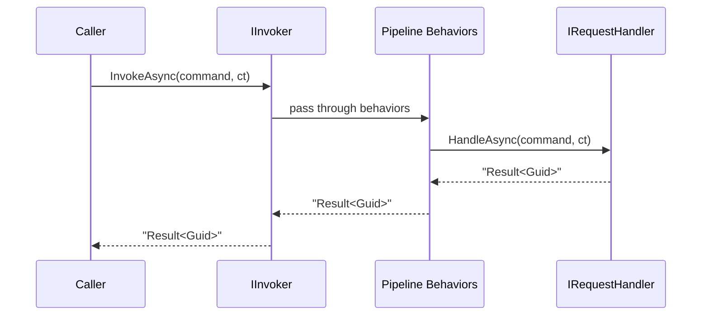

# Getting Started

This guide walks you through installing Synapse, wiring it up in a .NET application, and sending your first command end-to-end.

## Install

```bash
dotnet add package UnambitiousFx.Synapse
```

For web API projects, also install the ASP.NET Core integration layer:

```bash
dotnet add package UnambitiousFx.Synapse.AspNetCore
```

## Register Synapse

Call `AddSynapse` in your `Program.cs` or `Startup.cs`:

```csharp
builder.Services.AddSynapse(cfg =>
{
    cfg.RegisterRequestHandler<CreateTaskHandler, CreateTaskCommand, Guid>();
});
```

Every handler must be registered explicitly — Synapse does not auto-discover handlers by convention.

### What gets registered automatically

`AddSynapse` registers these services in the DI container (all scoped by default):

| Service            | Description                                  |
| ------------------ | -------------------------------------------- |
| `IInvoker`         | Send commands and queries.                   |
| `IEmitter`         | Publish in-process events.                   |
| `IContext`         | Per-scope correlation ID and metadata bag.   |
| `IContextAccessor` | Access the current `IContext` from anywhere. |
| `IOutboxCommit`    | Flush deferred (outbox) events.              |

## Define a command

A **command** is a plain record or class that implements `IRequest<TResponse>`:

```csharp
using UnambitiousFx.Synapse.Abstractions;

public record CreateTaskCommand(string Title) : IRequest<Guid>;
```

If the command produces no result, use `IRequest` (no type parameter):

```csharp
public record DeleteTaskCommand(Guid TaskId) : IRequest;
```

## Implement the handler

```csharp
using UnambitiousFx.Functional;
using UnambitiousFx.Synapse.Abstractions;

public class CreateTaskHandler : IRequestHandler<CreateTaskCommand, Guid>
{
    private readonly ITaskRepository _repository;

    public CreateTaskHandler(ITaskRepository repository)
    {
        _repository = repository;
    }

    public async ValueTask<Result<Guid>> HandleAsync(
        CreateTaskCommand command,
        CancellationToken ct = default)
    {
        if (string.IsNullOrWhiteSpace(command.Title))
            return Result.Failure<Guid>("Title cannot be empty.");

        var task = new TaskEntity { Id = Guid.NewGuid(), Title = command.Title };
        await _repository.SaveAsync(task, ct);

        return Result.Success(task.Id);
    }
}
```

Handlers receive the command and a `CancellationToken`. They always return `Result<TResponse>` — never throw for domain errors.

## Send the command

Inject `IInvoker` and call `InvokeAsync`:

```csharp
public class TaskService
{
    private readonly IInvoker _invoker;

    public TaskService(IInvoker invoker)
    {
        _invoker = invoker;
    }

    public async Task CreateAsync(string title, CancellationToken ct)
    {
        var result = await _invoker.InvokeAsync(new CreateTaskCommand(title), ct);

        result.Match(
            success: id    => Console.WriteLine($"Created task {id}"),
            failure: error => Console.WriteLine($"Failed: {error}"));
    }
}
```

### Request dispatch flow



## Read the result

`Result<T>` supports several consumption patterns:

```csharp
// Option 1 — TryGet (out variables)
if (result.TryGet(out var id, out var error))
    Console.WriteLine($"Created: {id}");
else
    Console.WriteLine($"Error: {error}");

// Option 2 — Match (functional)
var message = result.Match(
    success: id    => $"Created: {id}",
    failure: error => $"Error: {error}");

// Option 3 — IsSuccess guard
if (result.IsSuccess)
    Process(result.Value);
```

For more detail on `Result`, see the [UnambitiousFx.Functional documentation](/lib-functional/result/).

## Complete example

```csharp
// Program.cs
using UnambitiousFx.Synapse;

var builder = WebApplication.CreateBuilder(args);

builder.Services.AddScoped<ITaskRepository, InMemoryTaskRepository>();
builder.Services.AddSynapse(cfg =>
{
    cfg.RegisterRequestHandler<CreateTaskHandler, CreateTaskCommand, Guid>();
});

var app = builder.Build();

app.MapPost("/tasks", async (
    CreateTaskCommand cmd,
    IInvoker invoker,
    CancellationToken ct) =>
{
    var result = await invoker.InvokeAsync(cmd, ct);
    return result.Match(
        success: id    => Results.Created($"/tasks/{id}", id),
        failure: error => Results.BadRequest(error.ToString()));
});

app.Run();
```

## Next steps

- [Commands and Queries](./commands-and-queries) — learn about queries, fire-and-forget commands, and more `IInvoker` patterns.
- [Pipeline Behaviors](./pipelines) — add logging, validation, or any cross-cutting concern.
- [Source Generator](./source-generator) — automate handler registration for larger projects.
