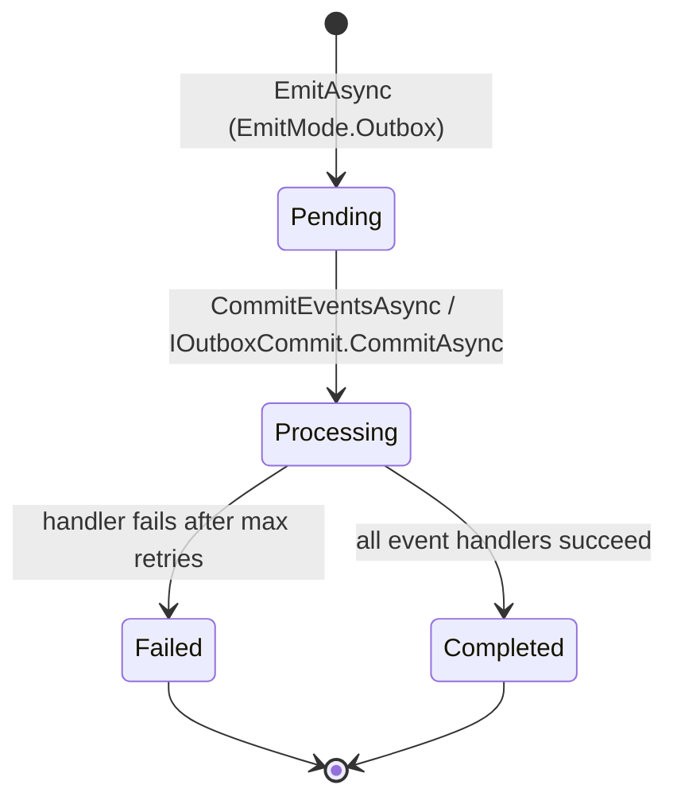

# Outbox Pattern

The outbox pattern decouples event publishing from handler execution. Instead of dispatching events immediately when `EmitAsync` is called, events are stored in an **outbox** and dispatched later in a controlled batch. This is useful when you need to guarantee that events are only dispatched after a database transaction commits successfully.

## How it works



1. `EmitAsync(event, EmitMode.Outbox)` stores the event in `IEventOutboxStorage`. No dispatch occurs.
2. Calling `context.CommitEventsAsync()` or `IOutboxCommit.CommitAsync()` moves pending events through the event pipeline and handlers.
3. If a handler fails, the outbox retries with exponential backoff up to `MaxRetryAttempts`.
4. After all retry attempts are exhausted, the event is marked `Failed` (dead-lettered).

## Using the outbox

### Store and defer an event

```csharp
// Store event in outbox — nothing dispatched yet
await context.PublishEventAsync(new TaskCreatedEvent(id, title), EmitMode.Outbox, ct);
```

### Flush after your side-effects commit

```csharp
public class CreateTaskHandler : IRequestHandler<CreateTaskCommand, Guid>
{
    private readonly ITaskRepository _repository;
    private readonly IContext _context;

    public CreateTaskHandler(ITaskRepository repository, IContext context)
    {
        _repository = repository;
        _context = context;
    }

    public async ValueTask<Result<Guid>> HandleAsync(CreateTaskCommand cmd, CancellationToken ct = default)
    {
        var id = Guid.NewGuid();

        await _repository.SaveAsync(id, cmd.Title, ct); // ← side-effect

        await _context.PublishEventAsync(
            new TaskCreatedEvent(id, cmd.Title),
            EmitMode.Outbox, ct);                        // ← store, don't dispatch yet

        await _context.CommitEventsAsync(ct);            // ← dispatch after save succeeded

        return Result.Success(id);
    }
}
```

You can also inject `IOutboxCommit` directly and call it outside the handler:

```csharp
await outboxCommit.CommitAsync(ct);
```

## Configure the outbox

Set outbox options in `AddSynapse`:

```csharp
services.AddSynapse(cfg =>
{
    cfg.ConfigureOutbox(opts =>
    {
        opts.MaxRetryAttempts  = 5;
        opts.InitialRetryDelay = TimeSpan.FromSeconds(1);
        opts.BackoffFactor     = 2.0;   // exponential: 1s, 2s, 4s, 8s, 16s
        opts.BatchSize         = 100;   // max events per CommitAsync call
    });
});
```

| Option              | Default         | Description                                                     |
| ------------------- | --------------- | --------------------------------------------------------------- |
| `MaxRetryAttempts`  | `3`             | Number of delivery attempts before marking the event as failed. |
| `InitialRetryDelay` | `TimeSpan.Zero` | Delay before the first retry.                                   |
| `BackoffFactor`     | `2.0`           | Multiplier applied to the delay for each subsequent retry.      |
| `BatchSize`         | unlimited       | Cap the number of events dispatched per `CommitAsync` call.     |

## Configure the default emit mode

If most of your events should use the outbox, set it as the default:

```csharp
cfg.SetDefaultPublishingMode(EmitMode.Outbox);
```

With this setting, `EmitAsync(event)` and `EmitAsync(event, EmitMode.Default)` store to the outbox automatically.

## Replace the storage for production

The built-in `InMemoryEventOutboxStorage` is suitable for testing and simple scenarios. For production, replace it with a persistent implementation:

```csharp
cfg.SetEventOutboxStorage<EfCoreEventOutboxStorage>();
```

Register `EfCoreEventOutboxStorage` in DI with whatever lifetime your database context uses, then implement `IEventOutboxStorage`:

```csharp
public class EfCoreEventOutboxStorage : IEventOutboxStorage
{
    private readonly AppDbContext _db;

    public EfCoreEventOutboxStorage(AppDbContext db) => _db = db;

    public async ValueTask<Result> AddAsync<TEvent>(TEvent @event, CancellationToken ct = default)
        where TEvent : class, IEvent
    {
        _db.OutboxEvents.Add(OutboxEvent.From(@event));
        await _db.SaveChangesAsync(ct);
        return Result.Success();
    }

    // ... implement remaining members
}
```

## Health check

Register the outbox health check to surface queue depth and lag in your `/health` endpoint:

```csharp
builder.Services.AddHealthChecks()
    .AddCheck<OutboxHealthCheck>("outbox", tags: ["ready"]);
```

Configure thresholds via `OutboxHealthCheckOptions`:

```csharp
builder.Services.Configure<OutboxHealthCheckOptions>(opts =>
{
    opts.DegradedPendingThreshold = 50;     // Degraded when > 50 pending
    opts.CriticalPendingThreshold = 200;    // Unhealthy when > 200 pending
    opts.CriticalLagThreshold     = TimeSpan.FromMinutes(5);
});
```

## See also

- [Events](./events) — `EmitMode` explained, how to publish events with `IEmitter`.
- [Observability](./observability) — outbox metrics (queue depth, lag, failed count).
