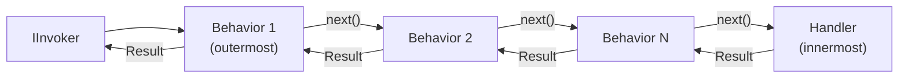

# Pipeline Behaviors

Pipeline behaviors let you wrap request, event, or stream handling with cross-cutting logic — logging, tracing, validation, or CQRS enforcement — without touching handler code. They follow the **chain-of-responsibility** (Russian-doll) pattern: each behavior calls `next()` to forward to the next behavior or to the handler.

## How the pipeline works



The first behavior registered is the **outermost** wrapper. Each behavior can inspect or modify the request and the result on both sides of `next()`.

## Request pipeline behaviors

### Untyped behavior — applies to all requests

Implement `IRequestPipelineBehavior` to intercept every command and query:

```csharp
public class TimingBehavior : IRequestPipelineBehavior
{
    private readonly ILogger<TimingBehavior> _logger;

    public TimingBehavior(ILogger<TimingBehavior> logger) => _logger = logger;

    public async ValueTask<Result<TResponse>> HandleAsync<TRequest, TResponse>(
        TRequest request,
        RequestHandlerDelegate<TResponse> next,
        CancellationToken ct)
        where TRequest : IRequest<TResponse>
        where TResponse : notnull
    {
        var sw = Stopwatch.StartNew();
        var result = await next();
        _logger.LogInformation("{Request} completed in {Ms}ms", typeof(TRequest).Name, sw.ElapsedMilliseconds);
        return result;
    }

    public async ValueTask<Result> HandleAsync<TRequest>(
        TRequest request,
        RequestHandlerDelegate next,
        CancellationToken ct)
        where TRequest : IRequest
    {
        var sw = Stopwatch.StartNew();
        var result = await next();
        _logger.LogInformation("{Request} completed in {Ms}ms", typeof(TRequest).Name, sw.ElapsedMilliseconds);
        return result;
    }
}

// Register
cfg.RegisterRequestPipelineBehavior<TimingBehavior>();
```

### Typed behavior — applies to one request type

Target a specific `TRequest` / `TResponse` pair:

```csharp
public class AuditCreateTaskBehavior : IRequestPipelineBehavior<CreateTaskCommand, Guid>
{
    public async ValueTask<Result<Guid>> HandleAsync(
        CreateTaskCommand request,
        RequestHandlerDelegate<Guid> next,
        CancellationToken ct)
    {
        var result = await next();
        if (result.IsSuccess)
            Audit.Log($"Task created: {result.Value}");
        return result;
    }
}

// Register
cfg.RegisterRequestPipelineBehavior<AuditCreateTaskBehavior, CreateTaskCommand, Guid>();
```

For fire-and-forget commands (`IRequest` without response), use `IRequestPipelineBehavior<TRequest>`.

### Conditional behavior

Register a behavior that only runs when a runtime predicate is satisfied:

```csharp
cfg.RegisterConditionalRequestPipelineBehavior<DebugBehavior>(
    req => req is IRequest<Guid>);  // only run for Guid-returning requests
```

## Built-in behaviors

### `SimpleLoggingBehavior`

Logs the request or event name and elapsed time. Implements both `IRequestPipelineBehavior` and `IEventPipelineBehavior`:

```csharp
cfg.RegisterRequestPipelineBehavior<SimpleLoggingBehavior>();
cfg.RegisterEventPipelineBehavior<SimpleLoggingBehavior>();
```

### `LoggingEnrichmentBehavior<TRequest, TResponse>`

Enriches the `ILogger` scope with `CorrelationId` and all context metadata so every log line emitted during the request automatically includes them:

```csharp
cfg.RegisterRequestPipelineBehavior<
    LoggingEnrichmentBehavior<CreateTaskCommand, Guid>,
    CreateTaskCommand,
    Guid>();
```

### CQRS boundary enforcement

`CqrsBoundaryEnforcementBehavior` detects when a command is dispatched from inside a query handler (or vice versa) and throws `CqrsBoundaryViolationException`. Enable it with:

```csharp
cfg.EnableCqrsBoundaryEnforcement();
```

## Event pipeline behaviors

Implement `IEventPipelineBehavior` to intercept all events:

```csharp
public class EventLoggingBehavior : IEventPipelineBehavior
{
    private readonly ILogger<EventLoggingBehavior> _logger;

    public EventLoggingBehavior(ILogger<EventLoggingBehavior> logger) => _logger = logger;

    public async ValueTask<Result> HandleAsync<TEvent>(
        TEvent @event,
        EventHandlerDelegate next,
        CancellationToken ct)
        where TEvent : class, IEvent
    {
        _logger.LogInformation("Dispatching event {Event}", typeof(TEvent).Name);
        return await next();
    }
}

cfg.RegisterEventPipelineBehavior<EventLoggingBehavior>();
```

## Stream pipeline behaviors

Implement `IStreamRequestPipelineBehavior` to intercept streaming requests:

```csharp
public class StreamLoggingBehavior : IStreamRequestPipelineBehavior
{
    public IAsyncEnumerable<Result<TItem>> HandleAsync<TRequest, TItem>(
        TRequest request,
        StreamRequestHandlerDelegate<TItem> next,
        CancellationToken ct)
        where TRequest : IStreamRequest<TItem>
        where TItem : notnull
    {
        Console.WriteLine($"Stream started: {typeof(TRequest).Name}");
        return next();
    }
}
```

## Registration order

Behaviors run in **registration order** — the first behavior registered is the outermost wrapper:

```csharp
cfg.RegisterRequestPipelineBehavior<LoggingBehavior>();   // runs first (outermost)
cfg.RegisterRequestPipelineBehavior<TracingBehavior>();   // runs second
cfg.RegisterRequestPipelineBehavior<ValidationBehavior>(); // runs last before handler
```

## See also

- [Validation](./validation) — `RequestValidationBehavior`, the built-in validation pipeline.
- [Observability](./observability) — `SimpleLoggingBehavior` and `LoggingEnrichmentBehavior` in detail.
- [Error Handling](./error-handling) — behaviors can short-circuit by returning `Result.Failure(...)` instead of calling `next()`.
