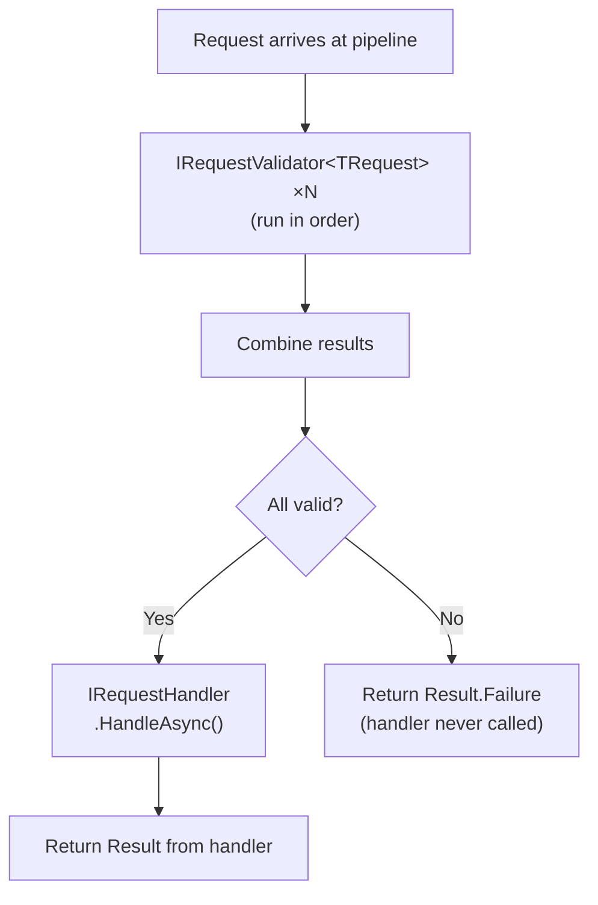

# Validation

Synapse provides a first-class validation mechanism that runs validators before the handler is invoked. If any validator fails, the handler is never called and the failure is returned to the caller.

## Define a validator

Implement `IRequestValidator<TRequest>` and return `Result.Failure(...)` when the request is invalid:

```csharp
using UnambitiousFx.Functional;
using UnambitiousFx.Synapse.Abstractions;

public class CreateTaskCommandValidator : IRequestValidator<CreateTaskCommand>
{
    public ValueTask<Result> ValidateAsync(CreateTaskCommand command, CancellationToken ct = default)
    {
        if (string.IsNullOrWhiteSpace(command.Title))
            return ValueTask.FromResult(Result.Failure("Title is required."));

        if (command.Title.Length > 200)
            return ValueTask.FromResult(Result.Failure("Title must be 200 characters or fewer."));

        return ValueTask.FromResult(Result.Success());
    }
}
```

## Register the validator and the validation behavior

Validation is implemented as a pipeline behavior, so you register both the validator and the behavior:

```csharp
services.AddSynapse(cfg =>
{
    cfg.AddValidator<CreateTaskCommandValidator, CreateTaskCommand, Guid>();

    cfg.RegisterRequestPipelineBehavior<
        RequestValidationBehavior<CreateTaskCommand, Guid>,
        CreateTaskCommand,
        Guid>();
});
```

`AddValidator` registers `IRequestValidator<CreateTaskCommand>` in DI. `RequestValidationBehavior` resolves all registered validators for the request type at runtime.

## Validation flow



## Multiple validators

You can register as many validators as you like for the same request type. All validators run and their results are combined via `.Combine()`. If any fail, all failures are aggregated:

```csharp
cfg.AddValidator<TitleValidator, CreateTaskCommand, Guid>();
cfg.AddValidator<DuplicateCheckValidator, CreateTaskCommand, Guid>();
// Both run; both failures are reported if both fail
```

## External validation libraries

`IRequestValidator<T>` is just an interface — you can adapt any validation library. Here is an example adapting FluentValidation:

```csharp
public class FluentCreateTaskValidator : IRequestValidator<CreateTaskCommand>
{
    private readonly IValidator<CreateTaskCommand> _validator;

    public FluentCreateTaskValidator(IValidator<CreateTaskCommand> validator)
        => _validator = validator;

    public async ValueTask<Result> ValidateAsync(CreateTaskCommand cmd, CancellationToken ct = default)
    {
        var validation = await _validator.ValidateAsync(cmd, ct);
        return validation.IsValid
            ? Result.Success()
            : Result.Failure(string.Join("; ", validation.Errors.Select(e => e.ErrorMessage)));
    }
}
```

## See also

- [Pipeline Behaviors](./pipelines) — validation is a pipeline behavior; understand registration order.
- [Error Handling](./error-handling) — how validation failures surface as `Result` at the call site.
