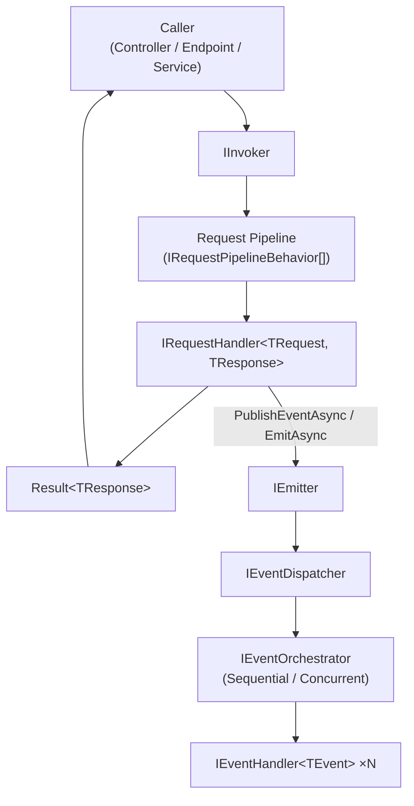

# Synapse

UnambitiousFx.Synapse is a lightweight, high-performance, in-process mediator for .NET. It routes commands, queries, and events through a structured pipeline with zero reflection at runtime.

## Key features

- **Commands & queries** — send typed requests and get `Result<T>` back via `IInvoker`.
- **Events** — fan-out to multiple handlers with sequential or concurrent orchestration.
- **Streaming** — return `IAsyncEnumerable<Result<T>>` for large or live data sets.
- **Pipeline behaviors** — wrap any request or event in cross-cutting concerns (logging, validation, CQRS enforcement).
- **NativeAOT-ready** — dispatch delegates are captured at startup; no `MakeGenericType`, no reflection at request time.
- **Result-based errors** — handlers return `Result` / `Result<T>` from [UnambitiousFx.Functional](/lib-functional); errors are values, not exceptions.

## Architecture overview



## Packages

```bash
dotnet add package UnambitiousFx.Synapse.Abstractions
dotnet add package UnambitiousFx.Synapse
dotnet add package UnambitiousFx.Synapse.AspNetCore   # optional — web API integration
dotnet add package UnambitiousFx.Synapse.Generator    # optional — source generator
```

Release channels for all UnambitiousFx libraries:

- Stable versions are available on [NuGet.org](https://www.nuget.org/).
- Pre-release versions are available on [MyGet](https://www.myget.org/F/unambitiousfx/api/v3/index.json).

| Package                              | Purpose                                                              |
| ------------------------------------ | -------------------------------------------------------------------- |
| `UnambitiousFx.Synapse.Abstractions` | All public interfaces, delegates, and attributes. No dependencies.   |
| `UnambitiousFx.Synapse`              | DI registration, invoker, dispatcher, context, outbox.               |
| `UnambitiousFx.Synapse.AspNetCore`   | `IHttpInvoker`, `IMvcInvoker`, `UseCorrelationId` middleware.        |
| `UnambitiousFx.Synapse.Generator`    | Roslyn source generator that eliminates manual handler registration. |

## Quick start

```csharp
// 1. Register
services.AddSynapse(cfg =>
    cfg.RegisterRequestHandler<CreateTaskHandler, CreateTaskCommand, Guid>());

// 2. Define
public record CreateTaskCommand(string Title) : IRequest<Guid>;

public class CreateTaskHandler : IRequestHandler<CreateTaskCommand, Guid>
{
    public ValueTask<Result<Guid>> HandleAsync(CreateTaskCommand cmd, CancellationToken ct = default)
    {
        var id = Guid.NewGuid();
        // ... persist ...
        return ValueTask.FromResult(Result.Success(id));
    }
}

// 3. Invoke
var result = await invoker.InvokeAsync(new CreateTaskCommand("Buy milk"));
result.Match(
    success: id    => Console.WriteLine($"Created: {id}"),
    failure: error => Console.WriteLine($"Error: {error}"));
```

## Design principles

- **Errors are values** — use `Result` / `Result<T>` throughout; exceptions are reserved for programming errors.
- **Zero runtime reflection** — dispatch delegates are compiled at DI registration time; safe for NativeAOT and trimming.
- **Composable pipelines** — cross-cutting concerns (logging, validation, tracing) are behaviors, not framework magic.
- **Explicit over implicit** — every handler and behavior is registered intentionally; nothing is auto-discovered by convention.

## Next steps

Follow this path from fundamentals to advanced integration:

1. [Getting Started](./getting-started) — install, configure, and send your first command.
2. [Commands and Queries](./commands-and-queries) — typed requests and the `IInvoker` API.
3. [Events](./events) — fan-out event publishing with `IEmitter`.
4. [Streaming](./streaming) — async-enumerable responses with `IStreamRequest<T>`.
5. [Context](./context) — per-request correlation ID, metadata, and feature bag.
6. [Pipeline Behaviors](./pipelines) — cross-cutting concerns and built-in behaviors.
7. [Validation](./validation) — request validation before the handler runs.
8. [Error Handling](./error-handling) — working with `Result` throughout the stack.
9. [Outbox Pattern](./outbox) — deferred event dispatch for transactional safety.
10. [ASP.NET Core Integration](./aspnetcore) — `IHttpInvoker`, `IMvcInvoker`, and correlation middleware.
11. [Source Generator](./source-generator) — eliminate registration boilerplate.
12. [Observability](./observability) — metrics, tracing, logging, and health checks.
